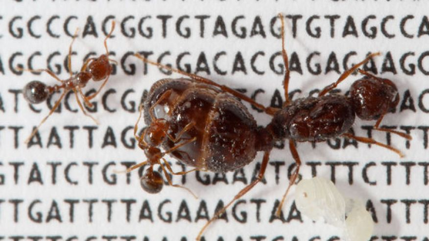
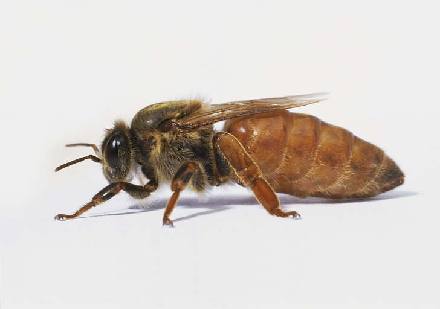
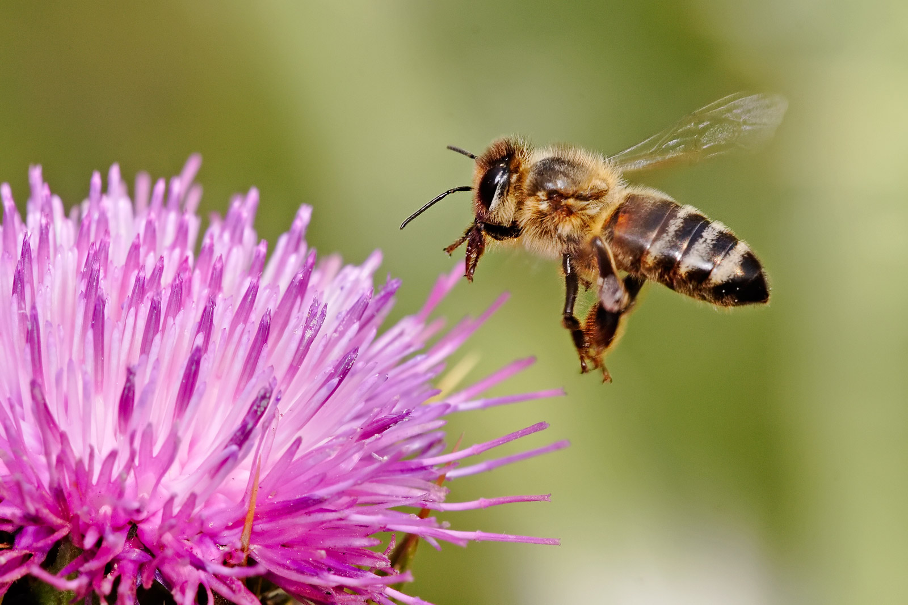
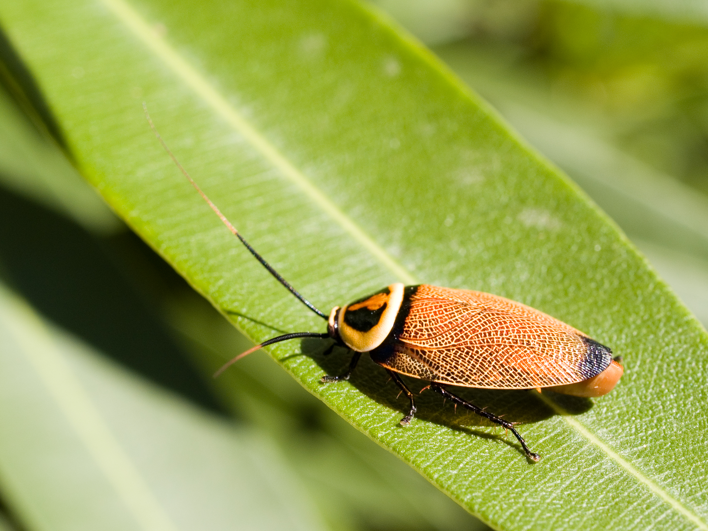

## Effective population size in insects

<a href="//bmpvieira.com/pgg48" target="_blank">bmpvieira.com/pgg48</a>

 

[Bruno Vieira](http://bmpvieira.com) | <i class="fa fa-twitter"></i> <a href="//twitter.com/bmpvieira" target="_blank">@bmpvieira</a>

Phd Student @ 

Bioinformatics and Population Genomics

Supervisor:  
Yannick Wurm | <i class="fa fa-twitter"></i>  <a href="//twitter.com/yannick__" target="_blank">@yannick__</a>

</small>

© 2014 <a href="http://bmpvieira.com" target="_blank">Bruno Vieira</a> <a href="http://creativecommons.org/licenses/by/4.0/deed.en_US" target="_blank">CC-BY 4.0</a>

---

### Number of Individuals vs Effective Pop. Size

---

 
[Li 2011](http://doi.org/10.1038/nature10231)

---

### Dictyoptera

---

### Goal
Run PSMC across a wide range of social insects and their solitary relatives

---

<a href="http://noflojs.org">
<section data-background="img/noflo.png"></section>
</a>

---

**[Bionode.io](http://bionode.io)**  - *Modular and universal bioinformatics*

Pipeable UNIX command line tools and JavaScript / Node.js APIs for bioinformatic analysis workflows on the server and browser.
<a class="" href="http://irccloud.com/#!/ircs://irc.freenode.net:6697/%23bionode">#bionode</a>
 
<a class="" href="http://gitter.im/bionode/bionode">gitter.im/bionode/bionode</a>

**[Dat-data.com](http://dat-data.com) ** - *Build data pipelines*

Provides a streaming interface between every file format and data storage backend. *"git for data"*
 
<a class="" href="http://irccloud.com/#!/ircs://irc.freenode.net:6697/%23dat">#dat</a>
 
<a class="" href="http://gitter.im/datproject/discussions">gitter.im/datproject/discussions</a>

 

 

---

<!-- <a href="http://dat-ncbi-arthropods-summary.inb.io" target="_blank">
<section data-background="img/dat-arthropod.png"></section>
</a>

--- -->

### Thanks!

Acknowledgements:

<i class="fa fa-twitter"></i> [@yannick__](http://twitter.com/yannick__)  

<i class="fa fa-twitter"></i> [@maxogden](http://twitter.com/maxogden)  

<i class="fa fa-twitter"></i> [@mafintosh](https://twitter.com/mafintosh)  

<i class="fa fa-twitter"></i> [@erikgarrison](http://twitter.com/erikgarrison)  

<i class="fa fa-twitter"></i> [@QM_SBCS](https://twitter.com/QM_SBCS)  

<i class="fa fa-twitter"></i> [@dat_project](https://twitter.com/dat_project)  

<i class="fa fa-github"></i> <a href="http://bionode.io">Bionode contributors 
</a>

---
